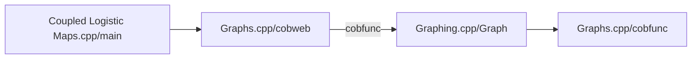

# Coupled Logistic Maps
## Flowchart

The program starts at the main() function in "Coupled Logistic Maps.cpp" where we can input a number to choose which mode to use. For example, mode 0 would cause the cobweb() function in "Graphs.cpp" to be called. This function's purpose is to start the ImGui instance and provide it with the function that is being used to plot. This means calling Graph() in "Graphing.cpp" with the function cobfunc() as one of the arguments. Graph() will then run a continuous loop at roughly 60 frames per second (unless the mode being used is computationally expensive), which involves calling the function given, cobfunc() in "Graphs.cpp" every frame.

## Building the project for yourself

The repo is missing its project file which is needed for compilation, simply reach out and I can supply a template which must be edited to include a reference to the Boost library. A link to the version used in this project can be found [here](https://github.com/boostorg/boost/releases/tag/boost-1.89.0) (version 1.89.0). Simply download and extract the files and copy the location of the boost_1_89_0 folder. 

To modify the project file to compile, right click the project file "Coupled Logistic Maps" and click Properties. Under the C/C++ dropdown, select General. Replace any text in the "Additional Include Directories" with the copied location of the Boost library folder, boost_1_89_0.